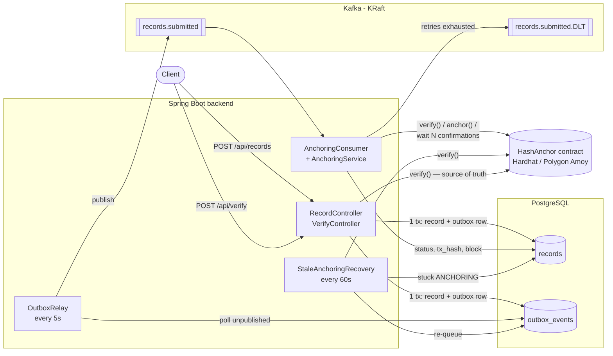
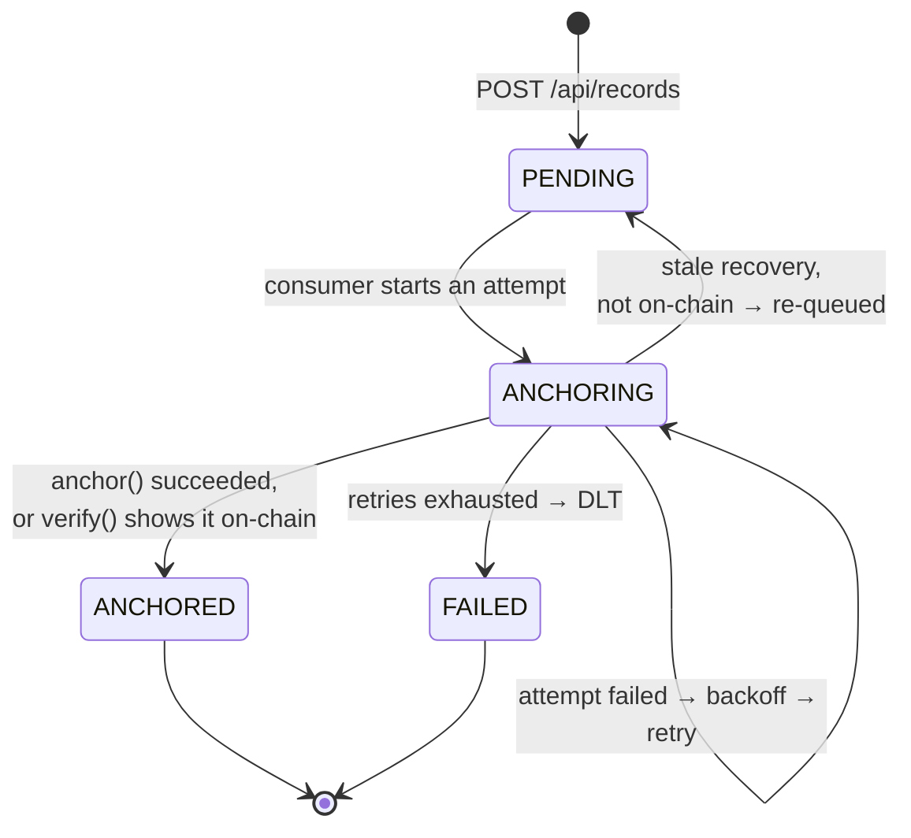

# hash-anchor

A document hash anchoring and verification service. Clients submit a
document; the backend hashes it (SHA-256), records it, and anchors the hash
on-chain through a Solidity contract. Anyone can later upload a file and
prove, against the chain itself, that this exact content was anchored and
when.

## The problem

You often need to prove that a document — a contract, a dataset, a build
artifact, a report — existed in *exactly* this form at a given time, to
someone who has no reason to trust your database. A row in Postgres saying
"we received this on Tuesday" is only as trustworthy as whoever can edit
Postgres.

A public blockchain gives you a timestamped, append-only record nobody
(including the service operator) can quietly rewrite. Only the document's
SHA-256 goes on-chain, so the content itself stays private, yet changing a
single byte of the file makes verification fail.

The hard part isn't the contract, it's the plumbing around it. An on-chain
write takes seconds, costs gas, can't be rolled back with a database
transaction, and can fail *ambiguously* — a timeout doesn't tell you whether
the transaction will still land. A naive "save the row, then call the chain"
in the request handler loses anchors on a crash, double-anchors on a retry,
and ends up with records that disagree with the chain.

This service runs anchoring through an asynchronous, at-least-once pipeline
(Postgres transactional outbox → Kafka → anchoring consumer → contract), built
so that crashes, duplicate events, reverts, timeouts and shallow reorgs never
cause a lost anchor, a double anchor, or a record that lies about what's
on-chain. The contract is always the source of truth.

- [Live deployment (Polygon Amoy)](#live-deployment-polygon-amoy)
- [Architecture](#architecture)
- [Record status lifecycle](#record-status-lifecycle)
- [Delivery guarantees and idempotency](#delivery-guarantees-and-idempotency)
- [Failure handling](#failure-handling)
- [Smart contract](#smart-contract)
- [Data model](#data-model)
- [HTTP API](#http-api)
- [Kafka topics](#kafka-topics)
- [Configuration](#configuration)
- [Running locally](#running-locally)
- [Running on Polygon Amoy](#running-on-polygon-amoy)
- [Demo](#demo)
- [Tests](#tests)
- [Repository layout](#repository-layout)
- [Known tradeoffs](#known-tradeoffs)
- [Spring Boot 4 and Jackson 3 notes](#spring-boot-4-and-jackson-3-notes)
- [Tech stack](#tech-stack)

---

## Live deployment (Polygon Amoy)

Deployed with Hardhat Ignition (`--network amoy`) and exercised end to end
by the backend running with the `amoy` profile.

| | Polygonscan |
|---|---|
| `HashAnchor` contract | [`0xF15aEAAD0E69f83104E7E0Ba90320531028b4ED5`](https://amoy.polygonscan.com/address/0xF15aEAAD0E69f83104E7E0Ba90320531028b4ED5) (deployed in [`0xf15beb1a…d458a0`](https://amoy.polygonscan.com/tx/0xf15beb1a144e6e0d15e95ad458616c184305a2623ab2fde547422f1befd458a0), block 48904244) |
| Example anchoring transaction | [`0xcfea24e7…1e78a7`](https://amoy.polygonscan.com/tx/0xcfea24e7d415ad7ffc99735688f4251ccdd3206d289223551a2b0867771e78a7) (block 48904353) |
| Owner / backend signer | [`0x834e81E56f7136260721FAC62946B570259c0D61`](https://amoy.polygonscan.com/address/0x834e81E56f7136260721FAC62946B570259c0D61) |

The example transaction anchors the SHA-256 of a one-line demo document,
`0x6f795c1704e43f7ba3a2a86751185280aeb0bd5ffa20d7542b50ed0b320cd910`. That
hash is the indexed topic of the `HashAnchored` event on the transaction's
*Logs* tab. The record went `PENDING → ANCHORING → ANCHORED` in about 10s
on its first attempt (49,179 gas). `POST /api/verify` returned
`anchored: true` for the document and `anchored: false` once one byte was
appended.

The contract's `owner` is the deploying wallet, which is also the backend's
signer; nobody else can call `anchor()`. `verify()` is a free `view` call
anyone can make from Polygonscan's *Read Contract* tab: paste the hash
above to see its block number and timestamp.

---

## Architecture



### 1. Submit — `POST /api/records`

The API computes the document's SHA-256, then **in a single database
transaction** saves a `records` row as `PENDING` and inserts an
`outbox_events` row describing a `RecordSubmitted` event. It returns
`202 Accepted` immediately; anchoring happens in the background.

This is the **transactional outbox pattern**: the request path never talks to
Kafka directly. Because the record and its event are written atomically, it's
impossible to have a record with no event (it would never be anchored) or an
event with no record.

### 2. Relay — `OutboxRelay`

A scheduled job (every 5 seconds by default, `hashanchor.outbox.poll-interval`) reads unpublished `outbox_events` rows
oldest-first, publishes each to the Kafka topic `records.submitted` (keyed by
record id, waiting for the broker's ack), and then marks the row published.

Publishing and marking are **two separate operations** — there's no
transaction spanning Postgres and Kafka. If the process crashes, or the DB
write fails, after Kafka acks but before the row is marked, the row is
published again on the next run. The same event can therefore reach the topic
twice. That's why delivery is **at-least-once**, and why the consumer must be
idempotent (see below).

### 3. Anchor — `AnchoringConsumer` + `AnchoringService`

A `@KafkaListener` consumes `records.submitted` and makes one anchoring
attempt per delivery:

1. **Load the record.** If it's already `ANCHORED` (duplicate event) or
   `FAILED` (terminal for the automated pipeline), skip it. `PENDING` and
   `ANCHORING` are both processed — `ANCHORING` means a previous attempt
   started and didn't finish, so it's resumed from the top.
2. **Mark `ANCHORING`** and increment `attempts` before touching the chain.
3. **`verify()` first.** If the hash is already on-chain (e.g. an earlier
   attempt's transaction landed but the DB update didn't), mark the record
   `ANCHORED` with the block number `verify()` returns — no new transaction.
   The `tx_hash` is recovered from the contract's `HashAnchored` event log in
   that block.
4. **Otherwise `anchor()`** via web3j and wait for the receipt (bounded by
   `receipt-timeout`: 30s locally, 60s on Amoy).
5. **On any `anchor()` failure** — revert, receipt timeout, RPC error — call
   `verify()` again. If the hash is now anchored, it's a success (e.g. a
   concurrent or earlier transaction won). If it still isn't, it's a genuine
   failure: save `last_error` and throw, which hands control to Spring
   Kafka's retry logic.
6. **Wait for confirmations.** Whichever way we learned the hash is on-chain
   (receipt, verify-first, or verify-after-failure), the record is only
   marked `ANCHORED` once the anchoring block has `confirmations` blocks on
   top of it *and* a fresh `verify()` still agrees. Then `tx_hash` and
   `block_number` are saved.
   - `confirmations` is **0 locally** (the Hardhat node only mines when a
     transaction arrives, so waiting would hang) and **5 on Amoy** (~10s).
   - If a reorg moved the anchor to a different block, counting restarts
     from that block and `tx_hash` is re-read from its event log.
   - If a reorg dropped it, or the confirmations don't arrive within
     `confirmation-timeout` (60s), the attempt throws and is retried like
     any other failure. The retry's verify-first step picks up wherever the
     chain actually is.

Transactions are EIP-155 signed for the configured `chain-id` (so a
misconfigured RPC URL gets them rejected rather than executed on the wrong
chain) and priced by `NetworkGasProvider`: the node's `eth_gasPrice`, capped
at `max-gas-price-gwei`, with a 100k gas limit (`anchor()` uses ~46,500).

No database transaction is held open across chain calls: each status update
is its own short transaction.

**Never branch on revert reason strings.** RPC providers and client layers
don't reliably preserve them. The contract's `require(..., "Already
anchored")` message exists for humans reading a block explorer;
the backend's only source of truth is `verify()`.

### 4. Retries and dead-lettering — `KafkaConsumerConfig`

When the listener throws, Spring Kafka's `DefaultErrorHandler` redelivers the
same message after an exponential backoff of **1s, 2s, 4s, 8s** (five
attempts in total). When retries are exhausted it:

1. publishes the event to **`records.submitted.DLT`** (with headers recording
   the original topic/partition/offset and the exception), then
2. marks the record **`FAILED`** with `last_error`,

and commits the offset so the partition moves on. If marking `FAILED` itself
fails, the offset isn't committed and the whole cycle repeats — possibly a
duplicate DLT entry, but never a `FAILED` record without one.

Errors that retrying can't fix (event references a non-existent record,
malformed JSON) skip the backoff and go straight to the DLT.

### 5. Stale-`ANCHORING` recovery — `StaleAnchoringRecovery`

Usually a crash mid-attempt needs no help: the offset wasn't committed, so
Kafka redelivers the event on restart and the consumer resumes the
`ANCHORING` record. This job covers the cases where that doesn't happen (e.g.
the event was dead-lettered but the process died before marking `FAILED`).

Every 60s it looks for records that have been in `ANCHORING` with no update
for longer than `stale-after` (5 minutes). The consumer touches the row at
the start of every attempt, and one attempt is bounded by
`receipt-timeout + confirmation-timeout` (2 minutes at most, on Amoy), so
live work is never mistaken for stuck. For each stale record it calls
`verify()`:

- **anchored on-chain** → mark `ANCHORED` once confirmed, with `tx_hash`
  from the event log;
- **not anchored** → reset to `PENDING` and insert a fresh outbox event, in
  one transaction, so the record goes back through the normal pipeline.

It never sends `anchor()` itself. A JPA `@Version` column on `records` makes
concurrent writes from this job and the consumer fail loudly instead of
overwriting each other.

### 6. Verify — `POST /api/verify`

Recomputes the uploaded file's SHA-256 and asks the **contract** whether it's
anchored. If so, it adds the block's timestamp and the anchoring transaction
hash (from the event log). The database is only consulted afterwards, to
attach the matching `recordId` if we have one — and if that lookup fails, the
chain's answer is still returned. A document the database thinks is anchored
but the chain doesn't know about is reported as **not anchored**.

---

## Record status lifecycle



| Status | Meaning |
|---|---|
| `PENDING` | Accepted and queued (via the outbox); no attempt in progress. |
| `ANCHORING` | The consumer has started an attempt and not finished it. |
| `ANCHORED` | The hash is on-chain with at least `confirmations` blocks on top; `block_number` set, `tx_hash` set when known. |
| `FAILED` | Retries exhausted; event sent to the DLT; `last_error` explains why. Treated as terminal by the automated pipeline — nothing re-drives it automatically. |

---

## Delivery guarantees and idempotency

Kafka delivery here is at-least-once, from two sources: the relay can publish
an outbox row twice, and the consumer can be redelivered a message it already
partly processed (crash before offset commit, retries). Every step of the
consumer is safe to repeat:

| Situation | What happens |
|---|---|
| Duplicate event, record already `ANCHORED` | Skipped without touching the chain. |
| Duplicate event, record still `PENDING`/`ANCHORING` but hash already on-chain | `verify()`-first catches it; marked `ANCHORED`, no new transaction. |
| Two `anchor()` transactions for the same hash | The contract rejects the second; the follow-up `verify()` resolves it as `ANCHORED`. |
| Crash mid-attempt | Offset not committed → redelivered → `ANCHORING` record resumed. |
| Record stuck in `ANCHORING` with no redelivery | Stale recovery re-checks the chain and either marks it `ANCHORED` or re-queues it. |
| Consumer and recovery job write the same row concurrently | `@Version` optimistic locking rejects the stale write. |

The contract is the final guard: it can never hold two anchors for one hash.

---

## Failure handling

| Failure | Handling |
|---|---|
| `anchor()` reverts | `verify()`; anchored → success, otherwise retry. |
| Receipt not seen within `receipt-timeout` | Same as a revert: `verify()`, then success or retry. |
| Reorg drops the anchor before it has `confirmations` blocks | Attempt throws → retry; verify-first sees it's gone and sends a fresh `anchor()`. |
| Confirmations don't arrive within `confirmation-timeout` | Attempt throws → retry; verify-first finds it anchored and waits again. |
| Gas price above `max-gas-price-gwei` | Transaction priced at the cap; if that's too low it stays unmined → receipt timeout → retry. |
| RPC / node unreachable | Exception → retry with backoff → eventually DLT + `FAILED`. |
| Signer out of funds, other persistent errors | Retries fail → DLT + `FAILED` with `last_error`. |
| Event for a non-existent record, malformed payload | Not retried; straight to DLT. |
| Kafka unavailable at relay time | Outbox row stays unpublished; retried on the next relay run. |
| Chain unavailable during `POST /api/verify` | `503 Service Unavailable` — never a false "not anchored". |

---

## Smart contract

`contracts/contracts/HashAnchor.sol` (Solidity 0.8.x):

```solidity
function anchor(bytes32 docHash) external;                  // owner only
function verify(bytes32 docHash) external view returns (bool, uint64);  // (anchored, blockNumber)
event HashAnchored(bytes32 indexed docHash, uint64 blockNumber);
```

- `anchor` is restricted to the deploying account (`owner`, immutable) and
  reverts if the hash is already anchored — each hash can be anchored exactly
  once, at the block it first landed in.
- `verify` is a free `view` call returning whether the hash is anchored and in
  which block.
- `HashAnchored` is indexed on `docHash`, which lets the backend find the
  anchoring transaction for a given hash with a narrow `eth_getLogs` query.

The backend calls the contract through a web3j Java wrapper generated at
build time from the Hardhat artifact (`generateContractWrappers` Gradle task).

---

## Data model

Schema is owned by Flyway (`backend/src/main/resources/db/migration`);
Hibernate only validates against it.

**`records`**

| Column | Type | Notes |
|---|---|---|
| `id` | `uuid` PK | |
| `document_hash` | `varchar(66)` | `0x`-prefixed SHA-256; indexed; not unique (the same document may be submitted twice) |
| `status` | `varchar(20)` | `PENDING` / `ANCHORING` / `ANCHORED` / `FAILED` |
| `tx_hash` | `varchar(66)` | Anchoring transaction, when known |
| `block_number` | `bigint` | Block the hash was anchored in |
| `attempts` | `int` | Anchoring attempts started |
| `last_error` | `text` | Most recent failure |
| `version` | `bigint` | Optimistic-lock counter |
| `created_at`, `updated_at` | `timestamptz` | |

**`outbox_events`**

| Column | Type | Notes |
|---|---|---|
| `id` | `uuid` PK | |
| `record_id` | `uuid` FK → `records` | Also the Kafka message key |
| `event_type` | `varchar(50)` | `RecordSubmitted` |
| `payload` | `jsonb` | `{"recordId": "...", "documentHash": "0x..."}` |
| `published` | `boolean` | Partial index on unpublished rows |
| `created_at`, `published_at` | `timestamptz` | |

---

## HTTP API

### `POST /api/records` — submit a document

```bash
curl -F file=@contract.pdf localhost:8080/api/records
```

`202 Accepted`

```json
{
  "id": "8429fcd7-6487-41bf-8281-0be886eb96dd",
  "documentHash": "0x3819dbb7c4c8bf436e8afc20a1deb27e4d16ff6fcf06c45b40f92164abeb5443",
  "status": "PENDING",
  "txHash": null,
  "blockNumber": null,
  "attempts": 0,
  "lastError": null,
  "createdAt": "2026-09-28T20:16:20.073Z",
  "updatedAt": "2026-09-28T20:16:20.073Z"
}
```

`400` if the file is empty. Max upload size is 25 MB.

### `GET /api/records/{id}` — check a submission

Same shape as above; `404` if unknown. Once anchored:

```json
{ "status": "ANCHORED", "txHash": "0x8a88…9977", "blockNumber": 6, "attempts": 1, ... }
```

### `POST /api/verify` — verify a document against the chain

```bash
curl -F file=@contract.pdf localhost:8080/api/verify
```

Anchored — `200 OK`:

```json
{
  "documentHash": "0x3819dbb7c4c8bf436e8afc20a1deb27e4d16ff6fcf06c45b40f92164abeb5443",
  "anchored": true,
  "blockNumber": 6,
  "anchoredAt": "2026-09-28T20:16:21Z",
  "txHash": "0x8a88a3bec75ac68a48760ac5e8b7eb1bb85b767f069069f4115eb5ade4df9977",
  "recordId": "8429fcd7-6487-41bf-8281-0be886eb96dd"
}
```

Not anchored (unknown file, or any byte changed) — also `200 OK`:

```json
{
  "documentHash": "0x8da6ac08a3c8cd58fe49a412c48f0ab64796c8f4bb1ee65f78945df6bbf1c36a",
  "anchored": false,
  "blockNumber": null,
  "anchoredAt": null,
  "txHash": null,
  "recordId": null
}
```

- `anchoredAt` is the anchoring block's timestamp.
- `txHash` can be `null` on an anchored result if the node can't serve the
  event log.
- `recordId` can be set while `anchored` is `false` — a submission that
  hasn't been anchored yet.
- `400` for an empty file; `503` if the chain can't be reached.

---

## Kafka topics

| Topic | Producer | Consumer | Key | Value |
|---|---|---|---|---|
| `records.submitted` | `OutboxRelay` | `AnchoringConsumer` (group `hash-anchor-anchoring`) | record id | outbox payload JSON |
| `records.submitted.DLT` | Spring Kafka `DeadLetterPublishingRecoverer` | — (for inspection / manual re-drive) | record id | original payload, plus `kafka_dlt-*` headers |

Both are created at startup if missing (1 partition each in dev). The
consumer commits offsets per record (`ack-mode: record`) and starts from the
earliest offset when the group has none.

---

## Configuration

`backend/src/main/resources/application.yml` holds the local defaults;
`application-amoy.yml` overrides the chain settings when the `amoy` Spring
profile is active (`--spring.profiles.active=amoy`). Only the keys a profile
file sets change — everything else keeps its `application.yml` value.

| Property | Env var | Local default | `amoy` profile | |
|---|---|---|---|---|
| `hashanchor.blockchain.rpc-url` | `HASHANCHOR_RPC_URL` (local), `AMOY_RPC_URL` (amoy) | `http://localhost:8545` | `https://polygon-amoy-bor-rpc.publicnode.com` | JSON-RPC endpoint |
| `hashanchor.blockchain.private-key` | `HASHANCHOR_PRIVATE_KEY` | **none — required** | same | Signer; must be the contract owner |
| `hashanchor.blockchain.contract-address` | `HASHANCHOR_CONTRACT_ADDRESS` | **none — required** | same | Deployed `HashAnchor` |
| `hashanchor.blockchain.chain-id` | | `31337` | `80002` | EIP-155 chain id transactions are signed for |
| `hashanchor.blockchain.gas-limit` | | `100000` | same | Per `anchor()` transaction |
| `hashanchor.blockchain.max-gas-price-gwei` | | unset (no cap) | `50` | Caps the node's `eth_gasPrice` |
| `hashanchor.blockchain.receipt-poll-interval` | | `500ms` | `2s` | Also used to poll for confirmations |
| `hashanchor.blockchain.receipt-timeout` | | `30s` | `60s` | |
| `hashanchor.blockchain.confirmations` | | `0` | `5` | Blocks on top before `ANCHORED` |
| `hashanchor.blockchain.confirmation-timeout` | | `60s` | same | `receipt-timeout + confirmation-timeout` must stay under Kafka's 5-minute `max.poll.interval.ms` and `stale-after` |
| `hashanchor.outbox.poll-interval` | | `5s` | How often `OutboxRelay` publishes pending events |
| `hashanchor.anchoring.stale-after` | `HASHANCHOR_STALE_AFTER` | `5m` | When an `ANCHORING` record counts as stuck |
| `hashanchor.anchoring.stale-check-interval` | | `60s` | |
| `spring.datasource.*` | | `localhost:5432/hashanchor` | Matches `docker-compose.yml` |
| `spring.kafka.bootstrap-servers` | | `localhost:9092` | Matches `docker-compose.yml` |

The private key and contract address have no defaults on purpose: a missing
value fails startup rather than falling back to a placeholder. The chain
settings (everything above except the RPC URL and key) are bound to a typed,
validated `BlockchainProperties` record, so a malformed contract address
also stops startup with a clear message. **Secrets are never committed** —
the private key is read from the environment only, by both the backend and
Hardhat (`.env` files are gitignored), and is deliberately kept out of that
record so it can't end up in its `toString()`.

---

## Running locally

Prerequisites: Docker, Java 21+, Node.js (for Hardhat).

**1. Start Postgres and Kafka**

```bash
docker compose up -d
```

**2. Start a local chain and deploy the contract** (in `contracts/`)

```bash
cd contracts
npm install
npx hardhat node                  # leave running; prints 20 funded dev accounts
```

In another terminal:

```bash
cd contracts
npx hardhat ignition deploy ignition/modules/HashAnchor.ts --network localhost
# → HashAnchorModule#HashAnchor - 0x5FbDB2315678afecb367f032d93F642f64180aa3
```

(After restarting the Hardhat node, add `--reset`: the new chain is empty and
Ignition's saved deployment state is stale.)

**3. Run the backend** (in `backend/`)

```bash
export HASHANCHOR_PRIVATE_KEY=<Account #0 private key printed by `npx hardhat node`>
export HASHANCHOR_CONTRACT_ADDRESS=<address printed by the deploy>
./gradlew bootRun
```

The build regenerates the web3j contract wrapper from
`contracts/artifacts/`, so run `npx hardhat build` in `contracts/` first if
it complains about a missing artifact.

**4. Try it**

```bash
echo "hello, chain" > doc.txt
curl -F file=@doc.txt localhost:8080/api/records          # → 202, PENDING
curl localhost:8080/api/records/<id>                      # → ANCHORED within a second or two
curl -F file=@doc.txt localhost:8080/api/verify           # → anchored: true
echo "hello, chain!" > doc.txt
curl -F file=@doc.txt localhost:8080/api/verify           # → anchored: false
```

Inspecting the pipeline:

```bash
# records
docker exec hash-anchor-postgres psql -U hashanchor -c "select id, status, attempts, block_number from records"
# dead-lettered events
docker exec hash-anchor-kafka /opt/kafka/bin/kafka-console-consumer.sh \
  --bootstrap-server localhost:9092 --topic records.submitted.DLT --from-beginning --property print.key=true
```

---

## Running on Polygon Amoy

Same pipeline, pointed at the Amoy testnet (chain id 80002) instead of a
local node. Postgres and Kafka still run locally via docker compose.

**1. A funded wallet.** Create a fresh wallet used only for this. Its private
key goes in one of two places, and never in a tracked file:

- an exported environment variable:

  ```bash
  export HASHANCHOR_PRIVATE_KEY=0x...   # e.g. from a password manager; don't leave it in shell history
  ```

- or a `.env` file at the repo root, which `.gitignore` already excludes
  (check with `git check-ignore .env`):

  ```bash
  # .env
  HASHANCHOR_PRIVATE_KEY=0x...
  ```

  Neither Hardhat nor Spring Boot reads `.env` on its own. Load it into the
  shell you run the commands below from (in the repo root):

  ```bash
  set -a; . ./.env; set +a   # set -a exports every variable the file defines
  ```

Print its address (in `contracts/`; prints the address only), then get test
POL for it from the [Polygon faucet](https://faucet.polygon.technology/) and
check it arrived on [amoy.polygonscan.com](https://amoy.polygonscan.com):

```bash
node -e 'console.log(new (require("ethers").Wallet)(process.env.HASHANCHOR_PRIVATE_KEY).address)'
```

About 0.02 POL covers the deploy (~344k gas at ~30 gwei ≈ 0.01 POL) and a
few anchors (~46.5k gas each, at most 50 gwei ≈ 0.0023 POL).

**2. Deploy the contract** (in `contracts/`):

```bash
npx hardhat ignition deploy ignition/modules/HashAnchor.ts --network amoy
# Confirm deploy to network amoy (80002)? … y
# → HashAnchorModule#HashAnchor - 0x…
```

The `amoy` network in `hardhat.config.ts` signs with `HASHANCHOR_PRIVATE_KEY`
(the same key the backend uses, so the deployer is the contract owner) and
pins a 30 gwei priority fee: Amoy's fee suggestion is skewed by a few
transactions paying 500 gwei, while nearly everything lands at ~30. Set
`AMOY_RPC_URL` to use a provider other than PublicNode. Ignition writes the
deployment record to `contracts/ignition/deployments/chain-80002/`; commit
it — it's public provenance (addresses, transactions, the exact build), not
a secret.

**3. Run the backend with the `amoy` profile** (in `backend/`). Start from
an empty database, so records left `PENDING` by local runs aren't anchored on
Amoy with real test POL (this deletes your local compose data):

```bash
docker compose down -v && docker compose up -d        # in the repo root
export HASHANCHOR_CONTRACT_ADDRESS=<address from step 2>
./gradlew bootRun --args='--spring.profiles.active=amoy'
```

A submitted document now takes ~15–20s to reach `ANCHORED`: up to 5s for
the outbox relay, a few seconds for the transaction to be mined, then 5
confirmations at ~2s each.

---

## Demo

With the backend running (locally or on Amoy):

```bash
echo "hash-anchor demo $(date -u +%FT%TZ)" > demo.txt

# 1. Submit → 202 Accepted, status PENDING
curl -s -F file=@demo.txt localhost:8080/api/records
# {"id":"<record id>","documentHash":"0x…","status":"PENDING",…}

# 2. Poll until ANCHORED (a second or two locally, ~20s on Amoy)
curl -s localhost:8080/api/records/<record id>
# {…,"status":"ANCHORED","txHash":"0x…","blockNumber":…,"attempts":1,…}

# 3. Verify the same file against the contract → anchored: true
curl -s -F file=@demo.txt localhost:8080/api/verify
# {"documentHash":"0x…","anchored":true,"blockNumber":…,"anchoredAt":"…","txHash":"0x…","recordId":"<record id>"}

# 4. Change one byte → anchored: false
echo "!" >> demo.txt
curl -s -F file=@demo.txt localhost:8080/api/verify
# {"documentHash":"0x…","anchored":false,…}
```

On Amoy, the `txHash` from step 2 is viewable at
`https://amoy.polygonscan.com/tx/<txHash>`; its *Logs* tab shows the
`HashAnchored` event with the document hash as its indexed topic.

---

## Tests

`./gradlew test` needs nothing: plain unit tests, no Docker, no network.
`./gradlew integrationTest` needs **Docker running**, and nothing else. Those
tests start their own throwaway containers on random ports (Testcontainers)
and never touch the docker compose stack or a hand-started Hardhat node.

**Contracts** (`contracts/`): `npx hardhat test`

**Backend unit tests** (`backend/`): `./gradlew test`

- `AnchoringServiceTest`: the consumer's decision logic with the chain and
  repository mocked. Covers skip on `ANCHORED`/`FAILED`, verify-first,
  resume from `ANCHORING`, failure-then-verify-says-anchored, genuine
  failure, `tx_hash` recovery from logs, `markFailed`, and the confirmation
  wait (confirmed in place, moved by a reorg, dropped by a reorg, timed out).
- `VerificationServiceTest`: `/api/verify` logic for anchored, unknown,
  chain-overrules-database, database-down, and RPC failure.

**Backend integration tests** (`backend/`): `./gradlew integrationTest`

These run against **Postgres, Kafka and Hardhat node containers**. The
Hardhat image is built from `backend/src/test/resources/hardhat/Dockerfile`
(the same Hardhat version as `contracts/`), and `HashAnchor` is deployed to
it from Java. Tests that boot the app extend `AbstractIntegrationTest`, so
they all share one Spring context, with the outbox relay polling every
200ms instead of 5s.

- `HashAnchorBackendApplicationTests`: smoke test that boots the whole app
  (migrations, JPA validation, Kafka listeners, web server).

- `AnchoringPipelineIntegrationTest`: the full pipeline with nothing mocked.
  Real HTTP to the running app, then outbox, relay, Kafka, consumer, chain,
  and back out through `/api/verify`:
  - a submitted file reaches `ANCHORED` and verifies with the same block,
    `tx_hash` and record id;
  - a file with one bit flipped fails verification (and a never-submitted
    file is reported as not anchored);
  - a duplicate event for an `ANCHORED` record is skipped, with no new
    transaction;
  - a duplicate event after a "lost" DB write is resolved from the chain
    (same block, `tx_hash` from the event log), again with no new
    transaction.
- `AnchorClientIntegrationTest`: `anchor()`, `verify()`, event-log lookup,
  block timestamps, and `awaitConfirmations` (0 confirmations, enough
  blocks mined on top, timeout) against the real chain — with EIP-155
  signing and `NetworkGasProvider` pricing, as in production.

The first `integrationTest` run builds the Hardhat image (about a minute).
It's kept locally as `hash-anchor-test-hardhat:3.18.0` so later runs skip
that; delete it with `docker rmi` if you want the space back. If you bump
Hardhat in `contracts/package.json`, bump `HARDHAT_VERSION` in that
Dockerfile and the image tag in `HardhatChain` to match.

---

## Repository layout

```
hashAnchoringService/
├── docker-compose.yml          Postgres 16 + Kafka 3.8 (KRaft, no ZooKeeper)
├── contracts/                  Hardhat 3 project
│   ├── contracts/HashAnchor.sol
│   ├── test/HashAnchor.ts
│   ├── ignition/modules/HashAnchor.ts
│   ├── ignition/deployments/   chain-80002/ = the Amoy deployment record (committed)
│   └── hardhat.config.ts       networks: localhost (Hardhat node), amoy
└── backend/                    Spring Boot 4 app (Gradle, Kotlin DSL)
    ├── build.gradle.kts        includes web3j wrapper codegen + integrationTest task
    └── src/main/java/com/hashanchor/
        ├── api/                RecordController, VerifyController, response DTOs
        ├── domain/             DocumentRecord, OutboxEvent, RecordStatus,
        │                       RecordService (submit), AnchoringService (consumer logic),
        │                       StaleAnchoringRecovery, VerificationService, DocumentHashes
        ├── persistence/        Spring Data repositories
        ├── messaging/          OutboxRelay, AnchoringConsumer, Topics
        ├── blockchain/         AnchorClient (web3j calls + confirmation wait), BlockchainConfig,
        │                       BlockchainProperties, NetworkGasProvider; wrapper generated into build/
        └── config/             KafkaConsumerConfig (retries, DLT, topics), SchedulingConfig
    └── src/main/resources/
        ├── application.yml         local defaults (Hardhat node)
        └── application-amoy.yml    `amoy` profile overrides
```

---

## Known tradeoffs

- **A receipt timeout can cause a second `anchor()` transaction.** If no
  receipt arrives within `receipt-timeout`, the attempt fails; `verify()` may
  still say "not anchored" because the first transaction is pending, not
  dropped. The retry then sends a second `anchor()`. Whichever lands second
  reverts and the follow-up `verify()` resolves the record as `ANCHORED` — so
  it's safe, but it wastes gas on the reverted transaction. A fix would be to
  remember the pending transaction's hash and check its receipt before
  re-sending.
- **Confirmation depth is a heuristic, not finality.** `ANCHORED` means
  "`confirmations` blocks deep and `verify()` still agrees" — 5 blocks on
  Amoy. That covers the shallow reorgs Polygon PoS actually sees, but a
  deeper reorg after the record is marked could still undo it, and nothing
  re-checks `ANCHORED` records afterwards. Polygon's checkpoint finality
  (Heimdall milestones) would be the stronger signal; `POST /api/verify`
  always asks the chain, so it can never report a reorged-out anchor as
  anchored.
- **The gas-price cap trades liveness for cost.** If Amoy's real minimum
  rises above `max-gas-price-gwei`, transactions sit unmined, time out, and
  the record eventually lands in `FAILED`. Raise the cap and re-drive.
  Transactions are legacy (type 0) because web3j 5's `ContractGasProvider`,
  which the generated wrapper prices every call with, only has a legacy gas
  price — no EIP-1559 fee fields. On Polygon that simply means
  `gasPrice = maxFee = maxPriorityFee`.
- **Public RPC.** The default Amoy endpoint is a free, shared, rate-limited
  node. Fine for a demo; anything real wants a dedicated provider via
  `AMOY_RPC_URL` (`eth_getLogs` and receipt polling are the heaviest calls).
- **`FAILED` is not re-driven automatically.** Recovering a failed record
  (e.g. after topping up the signer's balance) is a manual operation for now.

---

## Spring Boot 4 and Jackson 3 notes

The project was originally specified for Spring Boot 3.x, but 3.x had
reached end of life by the time the backend was started and
start.spring.io no longer generates it, so it's built on **Spring Boot 4**.
Things that differ from most Spring Boot 3 tutorials:

- **Jackson 3, new package.** Boot 4 auto-configures Jackson 3, whose core
  and databind classes live under `tools.jackson.*` rather than
  `com.fasterxml.jackson.*` — hence `tools.jackson.databind.ObjectMapper`
  in `RecordService` and `AnchoringConsumer`. (The annotations, e.g.
  `@JsonProperty`, keep their old `com.fasterxml.jackson.annotation`
  package.) Mixing in a library compiled against Jackson 2 means two
  separate `ObjectMapper` types that don't know about each other.
- **Jackson 3 exceptions are unchecked.** `JacksonException` extends
  `RuntimeException`, so `objectMapper.readValue(...)` needs no
  `try/catch` or `throws`. `KafkaConsumerConfig` lists
  `tools.jackson.core.JacksonException` (not Jackson 2's
  `JsonProcessingException`) as not-retryable, so a malformed event goes
  straight to the DLT instead of being retried five times.
- **`java.time` works out of the box.** Jackson 3 has Java 8 date/time
  support built in and writes dates as ISO-8601 strings by default — no
  `JavaTimeModule` registration or `WRITE_DATES_AS_TIMESTAMPS` tweak; the
  `Instant` fields in `RecordResponse` serialize as `"2026-09-28T20:16:20.073Z"`.
- **Modular starters.** Boot 4 splits auto-configuration into per-technology
  modules, so the starters are more specific: `spring-boot-starter-webmvc`
  (not `-web`), `spring-boot-starter-flyway` (the Flyway library alone no
  longer triggers auto-configuration), `spring-boot-starter-kafka`, and
  matching test starters (`spring-boot-starter-data-jpa-test`,
  `-webmvc-test`, …) instead of one `spring-boot-starter-test`.
- **Testcontainers 2.x** (managed by Boot 4) renames the modules:
  `org.testcontainers:testcontainers-postgresql` and
  `testcontainers-kafka` rather than `postgresql` / `kafka`.

---

## Tech stack

- **Backend:** Java 21, Spring Boot 4, Spring Data JPA, Spring Kafka, Flyway,
  Gradle (Kotlin DSL)
- **Data:** PostgreSQL 16, Apache Kafka 3.8 in KRaft mode
- **Chain:** Solidity 0.8.x, Hardhat 3 (local node for development), web3j;
  Polygon Amoy testnet (chain id 80002) for the live deployment
- **Tests:** JUnit 5, Mockito, AssertJ, Awaitility, Testcontainers (Postgres, Kafka, Hardhat), Hardhat (mocha + ethers)
- **Local infra:** Docker Compose
